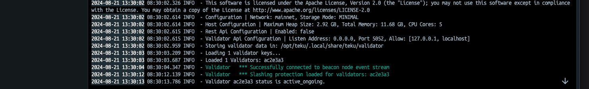
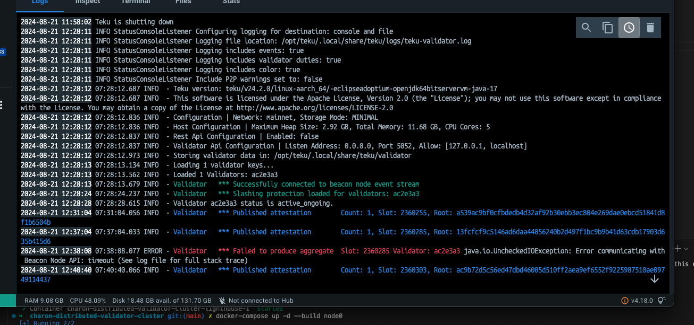
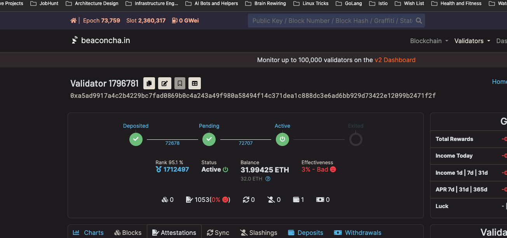
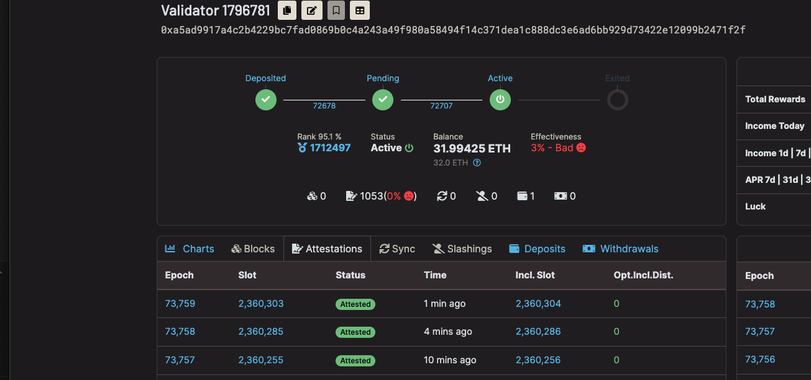
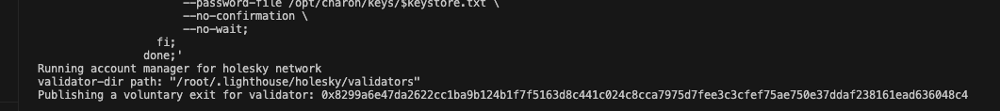

# Ethereum Validator Setup on Holesky Testnet

This README documents the setup and operation of our Ethereum validator on the Holesky Testnet, including evidence of its active participation in the network.

## Validator Logs

Below are screenshots of the validator logs, demonstrating its correct operation:

1. 

2. 

## Validator State on Beaconcha.in

The following screenshots from [beaconcha.in](https://beaconcha.in/) show our validator's active participation in the Holesky Testnet:

1. 

2. 

## Validator Exit Process

As part of the lifecycle management, we've documented the process of exiting a validator:

1. 

2. 

